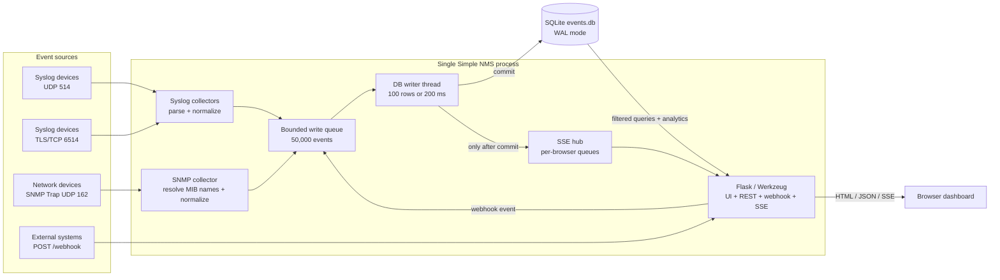

# Simple NMS

Lightweight Network Management System that collects **Syslog**, **SNMP Trap**, and **Webhook** events into a single SQLite database, with a real-time web dashboard.

Current release: **v26.8.26**.

## Features

- **Four event inputs** handled in one process:
  - Syslog (UDP 514) — RFC 3164 and RFC 5424 parsing (structured data to JSON, header metadata as tags)
  - SNMP Trap (UDP 162) — via pysnmp, varbinds stored as JSON
  - Webhook (HTTP POST `/webhook`) — JSON ingestion
  - Syslog TLS (TCP 6514, RFC 5425) — optional TLS listener with RFC 6587 octet-counting framing and newline-framing compatibility; configure certificates in the Web UI Settings page
- **SQLite storage** with WAL mode for concurrent writes, batched inserts (~5,000+ events/sec)
- **Real-time web dashboard** on port 80:
  - KPI cards (total / syslog / snmptrap / webhook counts)
  - Interactive Tabs: **Live Feed** and **Analytics Dashboard** (Event timeline, type distribution, severity breakdown, top source IPs)
  - Filterable event table with column sorting
  - Global search with 300ms debounce
  - Time range selector (5min / 1hr / today / custom)
  - Event type and source IP filters
  - Dark/light theme toggle
  - Responsive layout (mobile-friendly)
  - Server-Sent Events (SSE) for live updates
  - Task-oriented Settings page: independent Service, Syslog denylist, Syslog TLS, and custom MIB controls
- **Single Python process** — no external web server, message broker, or database server required
- **Reliability** — write failures are logged and tracked via dropped metrics
- **Reverse-proxy aware webhooks** — direct clients use the socket peer IP; requests forwarded by a local proxy can use `X-Forwarded-For` / `X-Real-IP` for the original client IP
- **Runtime SNMP community updates** — Web UI config changes update the running SNMP trap listener without restarting the service
- **Live Syslog source denylist** — validated IPv4/IPv6 addresses are dropped by both UDP and TLS collectors before parsing or storage; Settings changes apply without restarting

## Quick Start

```bash
# Install dependencies for local development
pip install -r requirements.txt

# Start on privileged ports (uses config.json from repo root)
cd src/simplenms
sudo python3 main.py ../../config.json

# Or with a custom config
sudo python3 main.py /path/to/config.json
```

Open `http://your-server` in a browser.

For a system install with virtualenv, permissions, MIB files, and systemd service setup:

```bash
sudo ./scripts/install.sh
```

The installer asks for the SNMP Trap community. Press Enter to keep the existing value during an upgrade or use `simplenms` on a first install.

## Reverse Proxy / HAProxy

Simple NMS can run directly or behind a local reverse proxy such as HAProxy.
When HAProxy runs on the same host, configure it to forward requests to the Simple NMS web port and add `X-Forwarded-For`:

```haproxy
frontend http_in
    bind *:80
    mode http
    default_backend simple_nms

backend simple_nms
    mode http
    option forwardfor
    http-request set-header X-Forwarded-Proto http
    server simple_nms_1 127.0.0.1:5000 check
```

With this setup, set `webhook.host` to `127.0.0.1` and `webhook.port` to `5000`.
Webhook events posted to `/webhook` will record the first value from `X-Forwarded-For`.
Forwarded client IP headers are trusted only when the immediate peer is loopback, so direct clients cannot spoof `src_ip` by sending their own forwarding headers.

## Architecture

Simple NMS runs as one Python process. Collection, storage, queries, and live
delivery are separate runtime paths inside that process:



### Event lifecycle

1. A collector parses an incoming message into the common `events` shape.
2. The collector places it in the shared 50,000-event queue without blocking.
3. The DB writer drains the queue in batches and commits to SQLite.
4. Only successfully committed events are published to browser SSE clients.
5. The UI initially reads SQLite through REST, then uses SSE as a refresh signal
   for newly committed events.

### Component boundaries

| Component | Owns | Does not own |
|-----------|------|--------------|
| Syslog collectors | UDP/TLS sockets, RFC 3164/5424 parsing, source denylist | Database connections or UI delivery |
| SNMP collector | Trap receiver, community, MIB/OID resolution | Database writes |
| DB writer | The only queued write path, batching, write metrics | API reads |
| Web application | Webhook input, REST queries, Settings API, static UI, SSE connections | Collector event parsing |
| SQLite | Durable event history and query indexes | Retention scheduling |

The HTTP listener serves the dashboard, REST API, Settings API, SSE, and webhook
on the same host and port. There is no built-in authentication, so expose it only
on a trusted management network or place an authenticated reverse proxy in front.

## Documentation

- [INSTALL.md](INSTALL.md) — Installation and deployment guide
- [USER.md](USER.md) — Usage guide with test examples
- [README.zh-TW.md](README.zh-TW.md) — Traditional Chinese project overview

## Operations

- Use the Web UI **Clear Old Events** action or `POST /api/events/cleanup` for retention cleanup.
- Use `cleanup.py` only when a local cron or container job is simpler than calling the API.
- **Service** settings save the SNMP community and Web/Webhook port independently. A Web port change still requires a service restart.
- **Syslog source denylist** accepts one IPv4 or IPv6 address per line and immediately updates both UDP and TLS collectors.
- **Syslog TLS** uses a deliberate flow: upload the server certificate/private key (and CA certificate for mTLS), then select **Apply TLS changes**. This immediately reloads TLS and disconnects current TLS Syslog clients. Files are stored under `data/tls/`; private keys are never returned by the API.
- **Custom MIBs** upload and delete independently; uploaded MIBs are loaded by the running resolver when possible.

## Tests

```bash
python3 tests/test_phase1.py
python3 tests/test_phase2.py
python3 tests/test_phase3.py
python3 tests/test_phase4.py
python3 tests/test_syslog_tls.py
```

The SNMP community hot-update check can also be run against a live service:

```bash
./scripts/check_community_update.py --base-url http://127.0.0.1 --trap-host 127.0.0.1 --trap-port 162 --restore
```

Verify a configured TLS Syslog listener:

```bash
./scripts/check_syslog_tls.py --base-url http://127.0.0.1 --tls-host 127.0.0.1 --tls-port 6514
```

## License

PolyForm Noncommercial License 1.0.0.

Commercial use, resale, or enterprise redistribution requires a separate
commercial license from the maintainer.
